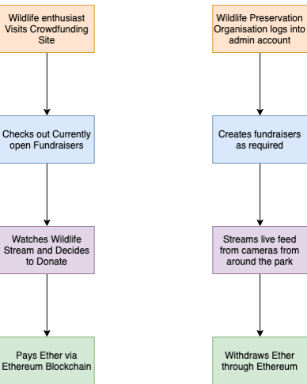

# WildSprint-Blockchain
Ethereum Blockchain component of WildSprint, a web application that incentivises donations to wildlife preservation organisations and makes them easily accessible, secure and transparent.

## WildSprint

### Description
An user-friendly web application for wildlife preservation organisations to obtain funds in a secure, safe and easily trackable manner. The application includes Dyte integration to livestream videos directly from the wildlife preservation organisations that make use of the website by registering as admin. Smart contracts on the Ethereum blockchain have been used to facilitate donations to the organisations by any user of the application.

### Abstract
Crowdfunding as it is right now could use more transparency. In this project, we attempt to make crowdfunding for wildlife preservation more secure, easily accessible and transparent. So we aim to create a web application that streams video feed from wild life sanctuaries/national parks etc while nature/wildlife enthusiasts can watch, subscribe and donate to them. In such a scenario, there are enough incentives on both sides. The wildlife enthusiasts get to watch the good they have done through their donations (given they cant travel directly because of the pandemic) and the national parks/wildlife sanctuaries receive a secure means of obtaining funds.   

Using Ethereum blockchain in this use case would make the donations safer, easier across borders and easily trackable. We’ll be using Dyte to live stream the videos directly from the national parks to the users who would like to donate.

### Flow

### Link to complete project
- [Frontend](https://github.com/ambur-biryani/wild-sprint-frontend)
- [Backend](https://github.com/ambur-biryani/wild-sprint-backend)  
